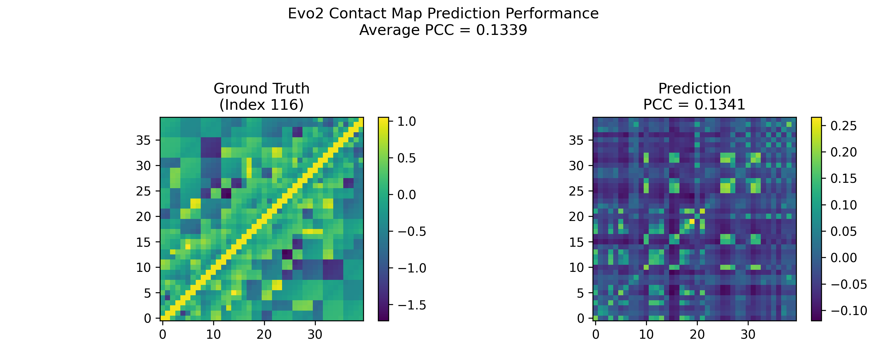
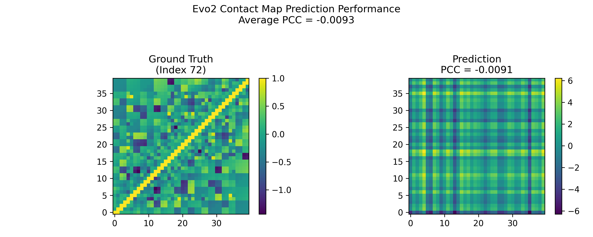

# Predicting 3D Chromatin Folding with Evo2 Embeddings

A transfer-learning study that uses frozen embeddings from the Evo2 7B DNA foundation model
to predict 40 x 40 chromatin contact maps from long genomic sequences.



## Project overview

Chromatin contact-map prediction requires translating one-dimensional DNA into a structured
two-dimensional representation of spatial proximity. This project tests whether a large
genomic language model already encodes useful 3D folding information and how prediction-head
capacity affects its accessibility.

Evo2 7B remained frozen while lightweight heads were trained on pairwise combinations of
sequence embeddings. A linear head, longer training, and a nonlinear MLP head were compared
under the same evaluation protocol.

## Architecture

```text
Long DNA sequence
       |
       v
Frozen Evo2 7B transformer
       |
       v
Intermediate 4,096-dimensional embeddings
       |
       v
Pool into genomic bins and concatenate every pair (8,192 features)
       |
       v
Linear head OR 8,192 -> 2,048 -> BatchNorm -> ReLU -> Dropout -> 1
       |
       v
40 x 40 chromatin contact map
```

Only the prediction head is optimized, reducing the trainable footprint while probing the
information contained in the foundation-model representation.

## Experiments and results

| Model | Epochs | Best validation loss | Average test PCC | PCC std. dev. |
|---|---:|---:|---:|---:|
| Linear head | 10 | 6.9496 | -0.0093 | 0.0452 |
| Linear head | 25 | 6.9220 | -0.0092 | 0.0452 |
| MLP + BatchNorm + Dropout | 10 | **0.2323** | **0.1339** | 0.0528 |
| DNALongBench CNN baseline (reported) | 30 | - | 0.0980 | - |

The nonlinear head improved average PCC by 0.1432 over the default head and exceeded the
reported CNN baseline by about 36.6%. Simply training the linear head longer did not improve
generalization, suggesting that head expressiveness—not training duration—was the main
bottleneck in this setup.

### Qualitative comparison

| Linear head | Improved MLP head |
|---|---|
|  |  |

## Repository structure

```text
.
├── src/
│   ├── finetune_contact_map.py # Linear-head baseline
│   ├── improved_finetune.py    # Nonlinear MLP experiment
│   ├── evaluate_contact_map.py # Test-set inference
│   └── analyze_performance.py  # PCC metrics and visualizations
├── results/                    # Metrics from all three runs
├── assets/                     # Representative contact-map figures
└── docs/project-report.pdf
```

## Setup and data

This project was developed in the Evo2/DNALongBench HPC environment and requires an NVIDIA
GPU, the Evo2 package and weights, and the DNALongBench Akita dataset loader. The lightweight
analysis script can be used independently with saved NumPy predictions.

```bash
python -m venv .venv
source .venv/bin/activate
pip install -r requirements.txt
```

The training scripts expect the DNALongBench loader at `datasets.akita_dataset` and TFRecord
shards for the HFF cell line. Pass the dataset directory with `--data_path` (or set the
`DNALONGBENCH_DATA_PATH` environment variable), then run:

```bash
python src/finetune_contact_map.py --model_name evo2_7b --data_path /path/to/tfrecords
python src/improved_finetune.py --model_name evo2_7b --data_path /path/to/tfrecords
python src/evaluate_contact_map.py --model_name evo2_7b --data_path /path/to/tfrecords
python src/analyze_performance.py
```

Weights, genomic data, and intermediate embeddings are excluded because of size and upstream
distribution constraints. Experiment tracking was performed with Weights & Biases.

## Interpretation and limitations

- The result supports the hypothesis that useful folding information exists in Evo2 embeddings
  but is not linearly decodable in this configuration.
- Evo2 was frozen; selectively unfreezing upper blocks may improve task adaptation.
- The MLP treats output pixels independently. A 2D convolutional, triangular, or cross-attention
  head could better encode contact-map structure and symmetry.
- The baseline value is taken from DNALongBench and was not reproduced in this repository.

## Acknowledgments

The starter pipeline was adapted from [DNALONGBENCH](https://github.com/ma-compbio/DNALONGBENCH); Evo2, its model
weights, and the benchmark data remain subject to their upstream licenses and usage terms.
